<div align="center">



<br>


<br>

[`ABOUT`](#about) &nbsp;&#183;&nbsp; [`WORK`](#experience) &nbsp;&#183;&nbsp; [`PROJECTS`](#selected-work) &nbsp;&#183;&nbsp; [`STACK`](#stack) &nbsp;&#183;&nbsp; [`CONTACT`](#contact)

</div>

<br>

## About

I am a final-year AI & Data Science engineering student and full-stack developer based in Pune, India.

I work across frontend systems, backend APIs, AI/ML pipelines, real-time applications, and developer tooling. My focus is turning complex technical requirements into software that is reliable, maintainable, and useful to real users.

I have worked in remote product teams and built production features, as well as independent systems involving AI, APIs, WebSockets, computer vision, and data processing.

<br>

<div align="center">

</div>

<br>

## What I Build

<table>
<tr>
<td width="70"><sub><b>01</b></sub></td>
<td><b>PRODUCT ENGINEERING</b><br><sub>Production-grade frontend and backend systems.</sub></td>
</tr>
<tr>
<td><sub><b>02</b></sub></td>
<td><b>AI SYSTEMS</b><br><sub>Applied AI, NLP, LLM integration, computer vision, and predictive systems.</sub></td>
</tr>
<tr>
<td><sub><b>03</b></sub></td>
<td><b>REAL-TIME SYSTEMS</b><br><sub>WebSockets, live state synchronization, queues, and event-driven workflows.</sub></td>
</tr>
<tr>
<td><sub><b>04</b></sub></td>
<td><b>DEVELOPER TOOLING</b><br><sub>Debugging systems, testing workflows, automation, and engineering utilities.</sub></td>
</tr>
<tr>
<td><sub><b>05</b></sub></td>
<td><b>DATA</b><br><sub>Data processing, synthetic datasets, analytics, and ML pipelines.</sub></td>
</tr>
</table>

<br>

## Experience

<table>
<tr>
<td width="34%" valign="top">
<b>Tenancy Passport</b><br>
Full Stack Developer Intern<br>
<sub>Oct 2025 &#8211; Jul 2026 &#183; Remote, UK</sub>
</td>
<td valign="top">
Production features across React and FastAPI. Authentication, secure data storage, and REST APIs, built within Dockerized, multi-service environments. Worked directly with product managers and engineering teams in an agile process, translating business requirements into shipped software.
</td>
</tr>
<tr>
<td valign="top">
<b>Tenancy Passport</b><br>
Frontend Developer Intern<br>
<sub>Jul 2025 &#8211; Oct 2025 &#183; Remote, UK</sub>
</td>
<td valign="top">
Reusable, responsive UI components in React and Tailwind CSS. Built dynamic onboarding forms with real-time validation, iterating closely with product and design based on user feedback.
</td>
</tr>
<tr>
<td valign="top">
<b>Dolphins Labs</b><br>
IoT & Microcontrollers Intern<br>
<sub>Jun 2023 &#8211; Jul 2023</sub>
</td>
<td valign="top">
IoT-based vehicle safety system with real-time obstacle detection and embedded data processing.
</td>
</tr>
</table>

<br>

## Selected Work

### 01 &#8212; AyurSutra <sub>MAR 2026</sub>

AI-powered healthcare platform combining predictive modeling, NLP analysis, and real-time clinical prioritization for Panchakarma therapy scheduling.

- Predictive neural network for therapy scheduling, trained on a 200,000-record synthetic dataset built through web scraping and generative data synthesis
- Scalable microservices architecture with an AI-powered NLP report analyzer that translates medical metrics into Ayurvedic Dosha classifications
- Dual patient–practitioner dashboards with a real-time priority queue, using LLM-computed severity scoring to triage high-risk patients


**[VIEW SOURCE &#8594;](https://github.com/RudraChintalwar/AyurSutra)**

<br>

---

<br>

### 02 &#8212; CodeContagion <sub>APR 2026</sub>

AI-driven platform for contextual debugging challenges and real-time multiplayer sessions.

- AI-powered backend (FastAPI, Groq API) generating contextual debugging challenges with reasoning-based, non-revealing analysis
- Structured scenario system with credibility scoring and risk analysis, mirroring real-world misinformation-verification workflows
- Real-time multiplayer features, including room-based sessions and live state synchronization over WebSockets


**[VIEW SOURCE &#8594;](https://github.com/RudraChintalwar/CodeContagion)**

<br>

---

<br>

### 03 &#8212; Privacy-Preserving Edge AI for Smart Parking <sub>OCT 2025</sub>

Real-time occupancy detection system built for edge deployment, with privacy-preserving analytics baked in rather than added on.

- YOLOv8-based detection running at 40&#8211;60 FPS, with an adaptive thresholding algorithm validated for greater than 95% accuracy under varying conditions
- Differential privacy and silhouette generation in place of raw video retention
- Built with DPDP Act, 2023 compliance in mind


<sub>Not yet public.</sub>

<br>

## Engineering Signals

<table align="center">
<tr>
<td align="center" width="140"><h3>9.16/10</h3><sub>GPA</sub></td>
<td align="center" width="140"><h3>200K</h3><sub>SYNTHETIC RECORDS</sub></td>
<td align="center" width="140"><h3>40&#8211;60 FPS</h3><sub>EDGE AI PERFORMANCE</sub></td>
</tr>
</table>

<table align="center">
<tr>
<td align="center" width="140"><h3>&gt;95%</h3><sub>VALIDATED ACCURACY</sub></td>
<td align="center" width="140"><h3>TOP 5</h3><sub>NIRMAN HACKATHON</sub></td>
<td align="center" width="140"><h3>FINALIST</h3><sub>TECHATHON 2.0</sub></td>
</tr>
</table>

<br>

## Stack

| | |
|---|---|
| **LANGUAGES** |      |
| **FRONTEND** |      |
| **BACKEND** |       |
| **AI / ML** |         |
| **DATA** |        |
| **TOOLS** |      |

<br>

## Build Log

A record of what I have been building, debugging, experimenting with, and shipping.

<div align="center">


<br>


<br>


</div>

<sub>Stats cards: [github-readme-stats](https://github.com/anuraghazra/github-readme-stats) · [streak-stats](https://github.com/DenverCoder1/github-readme-streak-stats) · [activity-graph](https://github.com/Ashutosh00710/github-readme-activity-graph)</sub>

<br>

## Contribution Map

<div align="center">
<picture>
  <source media="(prefers-color-scheme: dark)" srcset="https://raw.githubusercontent.com/RudraChintalwar/RudraChintalwar/output/github-contribution-grid-snake-dark.svg" />
  <source media="(prefers-color-scheme: light)" srcset="https://raw.githubusercontent.com/RudraChintalwar/RudraChintalwar/output/github-contribution-grid-snake.svg" />
  
</picture>
<sub><i>Snake animation auto-updates daily via GitHub Actions · <a href=".github/workflows/snake.yml">see workflow</a></i></sub>
</div>

<br>

## Currently Building

Working on a **personal portfolio site** — a full-stack, interactive developer portfolio designed to be as engineered as the work it showcases. Custom animations, live project data from the GitHub API, and a contact system backed by a lightweight API. Built with Next.js, Framer Motion, and deployed on Vercel.

<br>

## Experiments

Areas I explore outside of shipped project work:

- AI-assisted systems and LLM-backed application logic
- NLP pipelines for unstructured report and text analysis
- Synthetic data generation for model training
- Computer vision for real-time, resource-constrained environments
- Privacy-preserving analytics
- Real-time, event-driven architectures

<br>

## Achievements

| | |
|---|---|
| NIRMAN HACKATHON | Top 5 |
| TECHATHON 2.0 | Finalist |
| AGRITECH HACKATHON | Finalist |
| TECHNICAL PAPER PRESENTATION | 1st Prize |
| DEAN'S LIST | 2022 &#183; 2024 |

<br>

<details>
<summary><sub>EDUCATION</sub></summary>
<br>

**Pune Institute of Computer Technology (PICT)**
Bachelor of Engineering, Artificial Intelligence & Data Science
GPA: 9.16 / 10 &#183; Aug 2024 &#8211; Present &#183; Expected 2027

**RSCOE Polytechnic, Pune**
Diploma in Computer Engineering
92.57% &#183; Sep 2021 &#8211; Apr 2024

</details>

<br>

## Leadership

<table>
<tr>
<td width="34%" valign="top">
<b>TnP Student Head</b><br>
AI & Data Science Branch, TnP Council<br>
<sub>Present</sub>
</td>
<td valign="top">
Primary liaison between the Training & Placement Cell and AI&DS students — resolving queries and coordinating placement drives, eligibility criteria, and updates.
</td>
</tr>
<tr>
<td valign="top">
<b>President</b><br>
CESA, RSCOE<br>
<sub>2023 &#8211; 2024</sub>
</td>
<td valign="top">
Led Computer Engineering Student Association events and technical workshops, coordinating across student and faculty stakeholders.
</td>
</tr>
</table>

<br>

```
$ whoami
rudra-chintalwar

$ focus
full-stack / ai / systems

$ status
building
```

<br>

## Contact

**LET'S BUILD.**

Open to interesting engineering problems, ambitious products, and technically challenging work.

[LinkedIn](https://linkedin.com/in/rudra-chintalwar-b66087332) &nbsp;&#183;&nbsp; [GitHub](https://github.com/RudraChintalwar) &nbsp;&#183;&nbsp; [Email](mailto:rudrachintalwar@gmail.com) &nbsp;&#183;&nbsp; [Resume](assets/resume.pdf)

<br>

<div align="center">
<sub></sub>
<br><br>
<sub>&#169; 2026 RUDRA CHINTALWAR</sub>
<br>
<sub>Built with code, curiosity, and unreasonable attention to detail.</sub>
</div>
